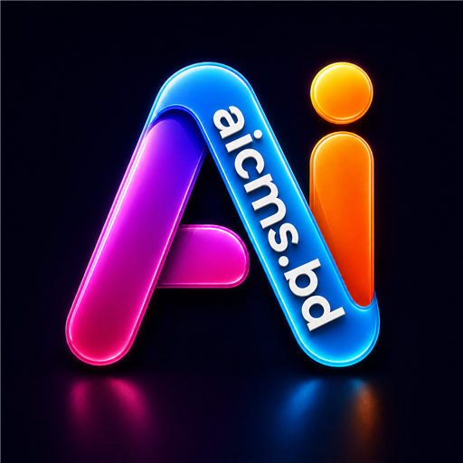

<div align="center">



# ⚡ Ultra System Monitor

### Free & Open System Monitoring for Everyone

**Powered by [AiCMS.BD](https://aicms.bd)** — Free software for the community. Freedom of privacy.

[](LICENSE)
[]()
[](https://aicms.bd)

A professional, real-time system monitoring sidebar with 3D glassmorphism design, detachable
speedometer widgets, per-core CPU stats, GPU/RAM/network/storage telemetry, and security health —
completely free, no ads, no tracking, no telemetry. **Your data never leaves your machine.**

</div>

---

## ✨ Features

- **CPU** — per-thread core grid, load, package temperature, clocks, voltage, power, fan RPM
- **GPU** — auto-detected NVIDIA / AMD / Intel (shown only when real hardware exists): load, temps, clocks, VRAM, power, fans + driver/display details
- **RAM** — usage, DDR speed & XMP detection, per-DIMM module details, page file, cache
- **Motherboard** — BIOS info, board & VRM temperatures, voltage rails, fan/pump RPMs
- **Network** — live up/down speeds, latency, daily & monthly data totals, 60-second real-time graph, every adapter's details
- **Storage** — all drives with capacity bars, temperatures, SMART status, read/write throughput
- **Security & Health** — Defender/firewall status, uptime, composite 0–100 health score
- **Detachable widgets** — pop any section out as a floating, resizable mini-widget and drag it anywhere on any monitor; each one switches between a compact card and an **analog speedometer gauge** 🧭
- **Fully yours** — 4 themes + custom accent color, English & বাংলা, drag-anywhere resizable sidebar, opacity, auto-hide, tray control, alerts with desktop notifications, CSV/JSON export, screenshots
- **Deep sensors** — optional [LibreHardwareMonitor](https://github.com/LibreHardwareMonitor/LibreHardwareMonitor) bridge (per-core temps, voltages, VRM, fan RPM) with automatic detection

## 📦 Install

Grab the latest from **[Releases](../../releases)**:

| Platform | File |
|---|---|
| Windows 10/11 | `UltraSystemMonitor-Setup-<version>.exe` |
| Linux (any distro) | `UltraSystemMonitor-<version>-x86_64.AppImage` |
| Debian / Ubuntu | `UltraSystemMonitor-<version>-amd64.deb` |

> Windows may show a SmartScreen notice because this freeware is unsigned — we spend our budget on
> building free software, not on certificates. Click *More info → Run anyway*. The full source code
> is right here so you can audit every line, or build it yourself:

```bash
git clone https://github.com/aicmsbd/ultra-system-monitor
cd ultra-system-monitor
npm install
npm start
```

## 🏗️ Architecture

```
Hardware ──► systeminformation (primary)  ─┐
        └──► LibreHardwareMonitor web API ─┼─► Electron main (fault-isolated polling)
             PowerShell / ping probes     ─┘        │ IPC push
                                        preload (contextIsolation, typed bridge)
                                                    ▼
                                 React + TypeScript renderer (3D glass UI,
                                 canvas gauges & graphs, CSS-variable themes)
```

Everything runs locally. No accounts, no cloud, no analytics — privacy is the default, not a setting.

---

## 💙 About AiCMS.BD — Software Freedom for the Community

[**AiCMS.BD**](https://aicms.bd) builds free software so that everyone — regardless of income or
language — has access to quality tools **and the freedom of privacy**. Every product is free for
the community:

| Project | What it is |
|---|---|
| ⌨️ [**Bangla Keyboard**](https://github.com/aicmsbd/bangla-keyboard) | Free Bangla typing for everyone |
| 🔤 [**Bangla Fonts**](https://github.com/aicmsbd/bangla-fonts) | Free, beautiful Bangla typefaces |
| 💻 [**Bangla OS**](https://github.com/aicmsbd/bangla-os) | An operating system that speaks your language |
| 🌐 [**Bangla Browser**](https://bangla.it.com/) | Browse in Bangla, privately |
| ⚡ **Ultra System Monitor** | This project — know your machine, own your data |

If these tools help you, star the repos and share them — that's all we ask. 🇧🇩

## 📄 License

[MIT](LICENSE) © 2026 [AiCMS.BD](https://aicms.bd) — free to use, study, share, and improve, forever.
